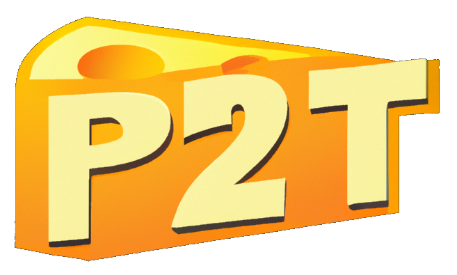

# The official Pomme2Terre website is here!


<p align="center">
    
</p>
<p align="center"><b>P2T's Website: <a href="https://bob.hackademint.org">https://bob.hackademint.org</a></b></p>
<p align="center">
    <a target="_blank" href="https://bob.hackademint.org"></a>
    <a target="_blank" href="https://bob.hackademint.org"></a>
</p>

## Installation
Create a virtual environment and download the requirements:
```shell
python -m venv venv
source venv/bin/activate
pip install -r requirements.txt
```

Then launch the Flask instance:
```shell
python app.py
```

### Using Docker
You can also use Docker:
```shell 
docker build -t bob . 
docker run -p 5000:5000 bob
```
